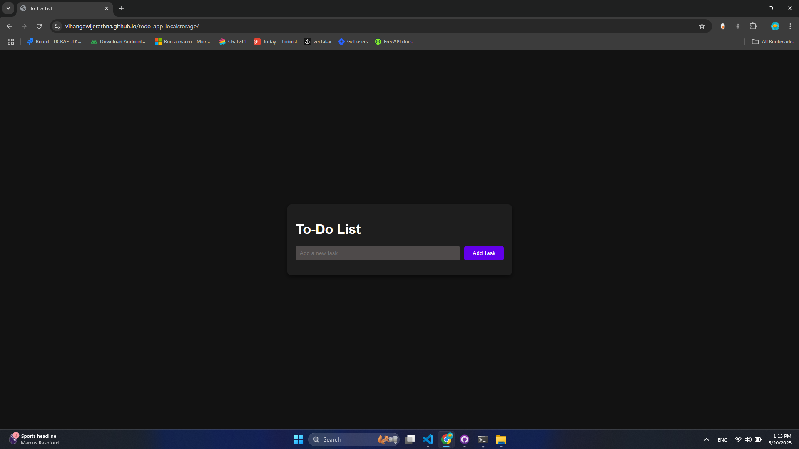

# Todo List App

A simple, elegant Todo List application built with HTML, CSS, and JavaScript. This app allows you to manage your tasks with a clean dark-mode interface, save your todos in the browser's local storage, and mark tasks as completed.

## Features
* Add new tasks
* Mark tasks as completed
* Delete tasks
* Data persists in browser's local storage
* Responsive dark mode interface
* Keyboard support (press Enter to add a task)

## Technologies Used
* HTML5
* CSS3
* JavaScript (ES6+)
* Local Storage API

## Screenshots



## Live Demo
You can try the live demo here: [Demo Link](https://vihangawijerathna.github.io/todo-app-localstorage)

## How to Use
1. Enter a task in the input field
2. Click the "Add Task" button or press Enter to add the task to your list
3. Click on a task to mark it as completed
4. Click the "Delete" button to remove a task

## Local Development
To run this project locally:
1. Clone this repository
   ```
   git clone https://github.com/your-username/todo-app-localstorage.git
   ```
2. Navigate to the project directory
   ```
   cd todo-app-localstorage
   ```
3. Open `index.html` in your browser

## Future Improvements
* Add due dates for tasks
* Add categories/tags for tasks
* Add sorting and filtering options
* Add drag-and-drop functionality to reorder tasks

## License
MIT License

## Contact
Created by [Your Name] - feel free to contact me!
